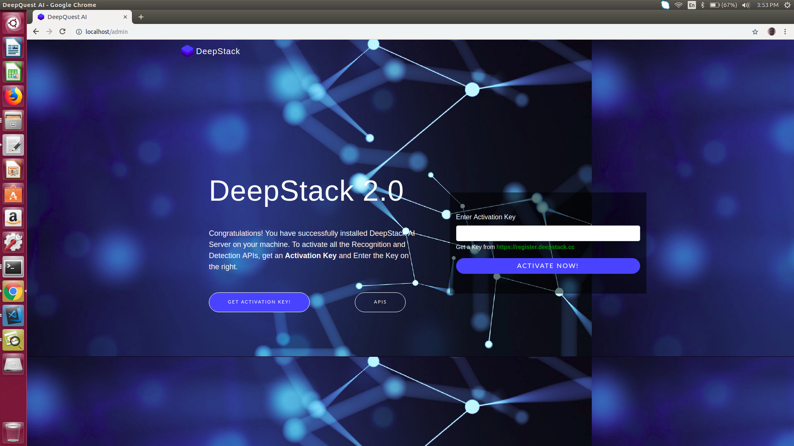
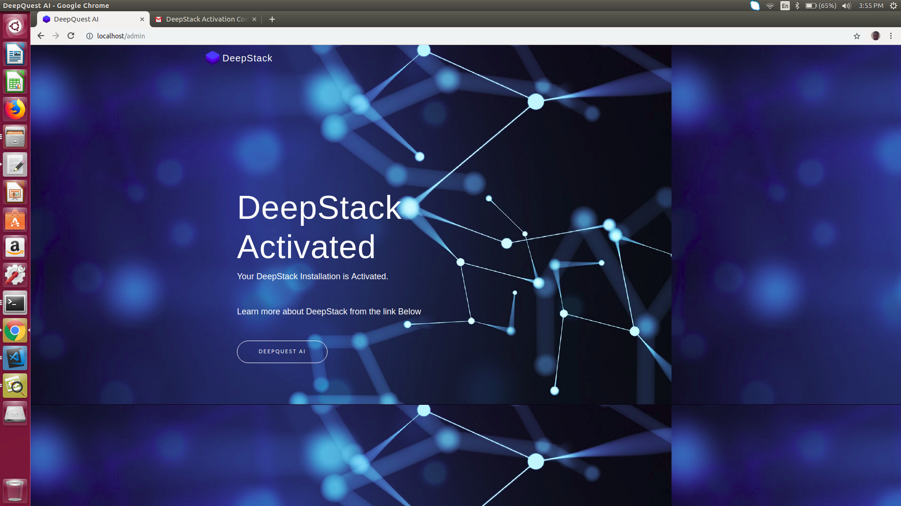

.. DeepStack documentation master file, created by
   sphinx-quickstart on Wed Dec 12 17:30:35 2018.
   You can adapt this file completely to your liking, but it should at least
   contain the root `toctree` directive.

.. _gpuinstall:

Using DeepStack with NVIDIA GPU
=================================

DeepStack GPU Version serves requests 5 - 20 times faster than the CPU version if you have an NVIDIA GPU.

**NOTE: THE GPU VERSION IS ONLY SUPPORTED ON LINUX**

Before you install the GPU Version, you need to follow the steps below.

Step 1: Install Docker
-----------------------
If you already have docker installed, you can skip this step.

::

  sudo apt-get update
  sudo apt-get install curl
  curl -fsSL get.docker.com -o get-docker.sh && sh get-docker.sh

Step 2: Setup NVIDIA Drivers
--------------------------------------

Install the NVIDIA Driver

`GUIDE: Nvidia Driver Install <http://www.linuxandubuntu.com/home/how-to-install-latest-nvidia-drivers-in-linux/>`_

Step 3: Install NVIDIA Docker
------------------------------

The native docker engine does not support GPU access from containers, however **nvidia-docker2** modifies your docker install
to support GPU access.

Run the commands below to modify the docker engine ::

    curl -s -L https://nvidia.github.io/nvidia-docker/gpgkey | \
    sudo apt-key add -

    distribution=$(. /etc/os-release;echo $ID$VERSION_ID)

    curl -s -L https://nvidia.github.io/nvidia-docker/$distribution/nvidia-docker.list | \
    sudo tee /etc/apt/sources.list.d/nvidia-docker.list

    sudo apt-get update

    sudo apt-get install -y nvidia-docker2

    sudo pkill -SIGHUP dockerd

If you run into issues, you can refer to this `GUIDE <https://devblogs.nvidia.com/gpu-containers-runtime//>`_

Step 4: Install DeepStack GPU Version
--------------------------------------
::

    sudo docker pull deepquestai/deepstack:gpu

Step 5: RUN DeepStack with GPU Access
--------------------------------------

Once the above steps are complete, when you run deepstack, add the args **--rm --runtime=nvidia** ::

    sudo docker run --rm --runtime=nvidia -e VISION-SCENE=True -v localstorage:/datastore \
    -p 80:5000 deepquestai/deepstack:gpu

Step 6: Activate DeepStack
---------------------------

The first time you run deepstack, you need to activate it following the process below.

Once you initiate the run command above, visit localhost:80/admin in your browser.
The interface below will appear.

You can obtain a free activation key from register.deepstack.cc `https://register.deepstack.cc <https://register.deepstack.cc />`_

Enter your key and click **Activate Now**

The interface below will appear.

This step is only required the first time you run deepstack.

