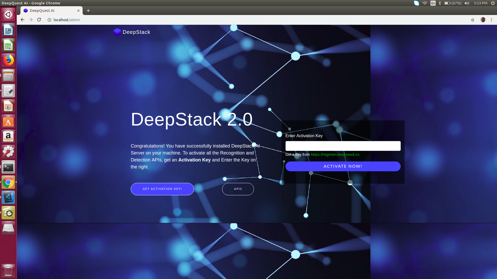
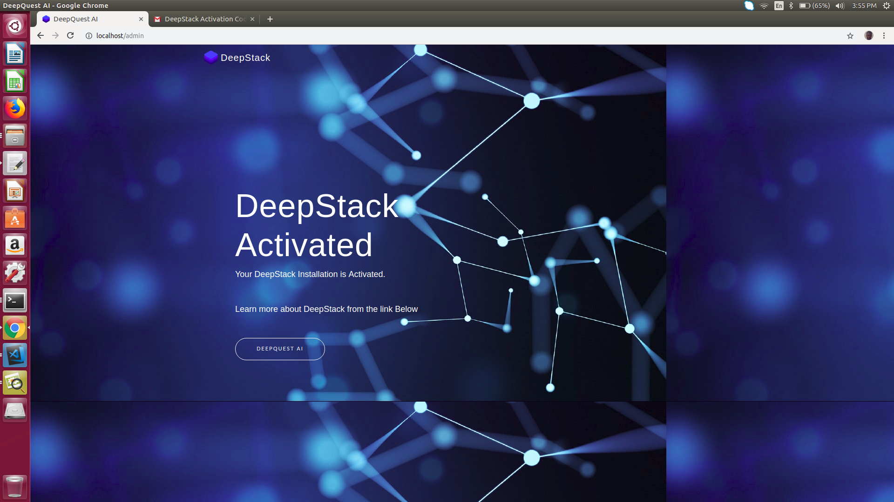

.. DeepStack documentation master file, created by
   sphinx-quickstart on Wed Dec 12 17:30:35 2018.
   You can adapt this file completely to your liking, but it should at least
   contain the root `toctree` directive.

.. _home:

DeepStack Beta - Python Guide
=============================

DeepStack is an AI server that empowers every developer in the world to 
easily build state-of-the-art AI systems both on premise and in the cloud.
The promises of Artificial Intelligence are huge but becoming a machine learning
engineer is hard. DeepStack runs on the docker platform and can be used from any
programming language.

You can learn more about Docker on `Docker's Website <https://docker.io />`_
Visit  `Docker Getting Started <https://docs.docker.com/get-started />`_ for instructions on setting up and using Docker for the first time.

DeepStack is developed and maintained by `DeepQuest AI <https://deepquestai.com />`_
-------------------------------------------------------------------------------------

.. figure:: image.jpg
   :align:  center 

Below, using DeepStack we attempt to classify the scene of the above image ::
    
    const request = require("request")
    const fs = require("fs")

    image_stream = fs.createReadStream("image.jpg")

    var form = {"image":image_stream}

    request.post({url:"http://localhost:80/v1/vision/scene", formData:form},function(err,res,body){

    response = JSON.parse(body)
    console.log(response)

    })

**Result**  ::

    { success: true, label: 'highway', confidence: 63.377846 }

You simply send in an image by POST and deepstack returns a JSON response detailing the label of 
the image as well as the confidence of the prediction on a scale of 0 - 1.

Installing DeepStack - CPU Version
===================================

The code above demonstrates using DeepStack to predict the scene of an image,
to run this, you can install DeepStack and start it with a single docker command.

Step 1: Install Docker
-----------------------
If you already have docker installed, you can skip this step.

**On Linux** ::

  sudo apt-get update
  sudo apt-get install curl
  curl -fsSL get.docker.com -o get-docker.sh && sh get-docker.sh

**On Windows or MacOS** 

  Follow instructions on `Docker Getting Started <https://docs.docker.com/get-started />`_

Step 2: Install DeepStack
--------------------------
::

    docker pull deepquestai/deepstack

Once installed, you can run DeepStack with the command below ::

    docker run -e VISION-SCENE=True -v localstorage:/datastore -p 80:5000 deepquestai/deepstack

The command above runs deepstack with the scene recognition activated, once this is running, you can run the example above.

Step 3: Activate DeepStack
---------------------------

The first time you run deepstack, you need to activate it following the process below.

Once you initiate the run command above, visit localhost:80/admin in your browser.
The interface below will appear.

You can obtain a free activation key from `https://register.deepstack.cc <https://register.deepstack.cc />`_

Enter your key and click **Activate Now**

The interface below will appear.

This step is only required the first time you run deepstack.

GPU Accelerated Version
========================

DeepStack runs many times faster on machines with NVIDIA GPUS, to install and use the GPU Version, 
read :ref:`gpuinstall`

**HARDWARE AND SOFTWARE REQUIREMENTS**

DeepStack runs on any platform with Docker installed.
However, for best performance, the following minimum requirements are highly recommended.

* Intel Core i5 processor

* 8 GB RAM

* 10 GB Disk Space

* Linux or Windows 10 Pro

**NOTE**

DeepStack works best on linux Systems

.. toctree::
   :maxdepth: 2
   :caption: Tutorials:

   getting-started
   facerecognition
   facedetection
   facematch
   objectdetection
   scenerecognition
   gpuinstall
   releasenotes

Indices and tables
==================

* :ref:`genindex`
* :ref:`modindex`
* :ref:`search`
