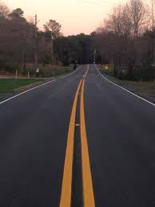

.. DeepStack documentation master file, created by
   sphinx-quickstart on Wed Dec 12 17:30:35 2018.
   You can adapt this file completely to your liking, but it should at least
   contain the root `toctree` directive.

DeepStack Beta
===============

DeepStack is an AI server that empowers every developer in the world to 
easily build state-of-the-art AI systems both on premise and in the cloud.
The promises of Artificial Intelligence are huge but becoming a machine learning
engineer is hard. DeepStack runs on the docker platform and can be used from any
programming language.

You can learn more about Docker on `Docker's Website <https://docker.io />`_
Visit  `Docker Getting Started <https://docs.docker.com/get-started />`_ for instructions on setting up and using Docker for the first time.

DeepStack is developed and maintained by `DeepQuest AI <https://deepquestai.com />`_
-------------------------------------------------------------------------------------

Below, using DeepStack we attempt to classify the scene of the above image ::
    
    import requests

    image_data = open("image.jpg","rb").read()

    response = requests.post("http://localhost:80/v1/vision/scene",files={"image":image_data}).json()

    print(response)

**Result**  ::

    {'label': 'highway', 'confidence': 63.377846, 'success': True}

You simply send in an image by POST and deepstack returns a JSON response detailing the label of 
the image as well as the confidence of the prediction on a scale of 1 - 100.

**Installing DeepStack**

The code above demonstrates using DeepStack to predict the scene of an image,
to run this, you can install DeepStack and start it with a single docker command.

If you are not familiar with docker, you can learn how to use Docker here.

To install DeepStack on Docker, simply run the docker command below ::

    docker pull deepquestai/deepstack

Once installed, you can run DeepStack with the command below ::

    docker run -e VISION-SCENE=True -v localstorage:/datastore -p 80:5000 deepquestai/deepstack

The command above runs deepstack with the scene recognition activated, once this is running, you can run the example above.

**GPU Accelerated Version**

DeepStack runs many times faster on machines with NVIDIA GPUS, to install and use the GPU Version, 
read :ref:`gpuinstall`

**HARDWARE AND SOFTWARE REQUIREMENTS**

DeepStack runs on any platform with Docker installed.
However, for best performance, the following minimum requirements are highly recommended.

* Intel Core i5 processor

* 8 GB RAM

* 10 GB Disk Space

* Linux or Windows 10 Pro

.. toctree::
   :maxdepth: 2
   :caption: Tutorials:

   getting-started
   facerecognition
   facedetection
   objectdetection
   trafficrecognition
   scenerecognition
   gpuinstall
   releasenotes

Indices and tables
==================

* :ref:`genindex`
* :ref:`modindex`
* :ref:`search`
