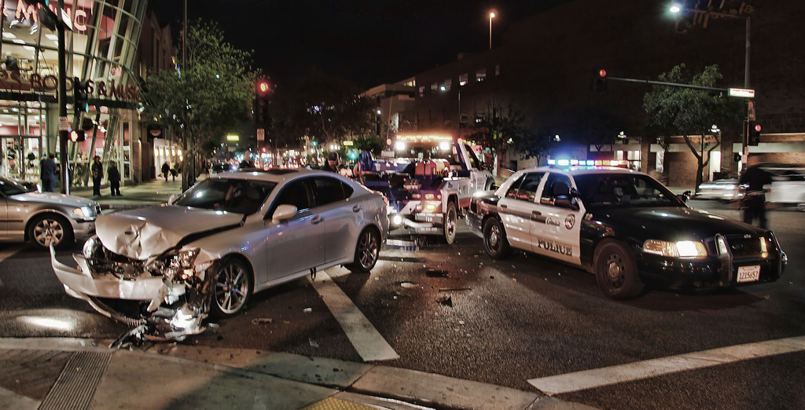

.. DeepStack documentation master file, created by
   sphinx-quickstart on Wed Dec 12 17:30:35 2018.
   You can adapt this file completely to your liking, but it should at least
   contain the root `toctree` directive.

Traffic Recognition
====================

The traffic recognition api classifies an image into one of the following ::
    Sparse traffic
    Dense traffic
    Accident
    Fire

With this, from images of live traffic, you can tell if an accident has occured,
if there is traffic gridlock or if a vehicle is on fire.

**Example**

::

    import requests
    
    image_data = open("test-image4.jpg","rb").read()
    
    response = requests.post("http://localhost:80/v1/vision/traffic",files={"image":image_data}).json()
    
    for prediction in response["predictions"]:
        print(prediction["label"])
    
    print(response)

Result ::

    accident
    {'success': True, 'predictions': [{'label': 'accident', 'confidence': 94.88775730133057}]}
